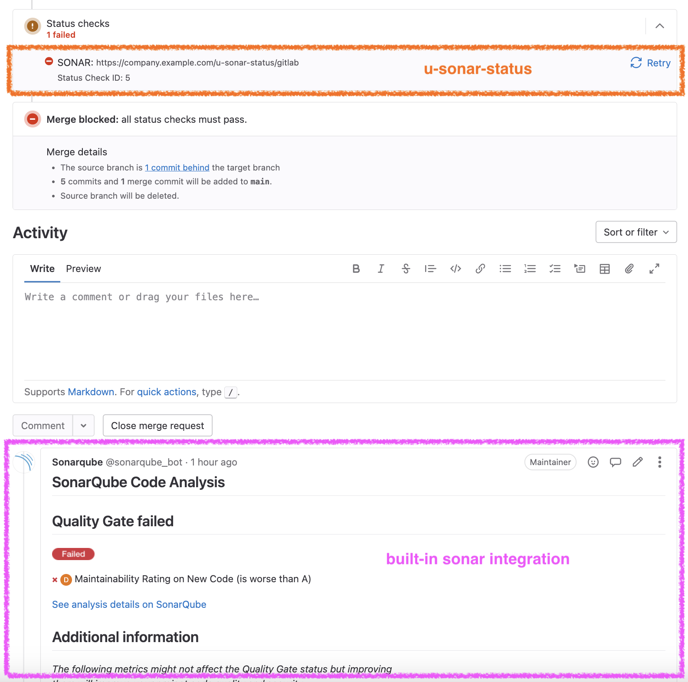

//tag::vardef[]
:gh-repo-owner: unblu
:gh-repo-name: u-sonar-status

:project-name: u-sonar-status
:git-branch: main
:license: http://www.apache.org/licenses/LICENSE-2.0
:license-name: Apache 2.0 License

:git-repository: {gh-repo-owner}/{gh-repo-name}
:homepage: https://{gh-repo-owner}.github.io/{gh-repo-name}/
:issues: https://github.com/{git-repository}/issues
//end::vardef[]

= {project-name}

Bot to report a SonarQube (or SonarCloud) "Pull Request https://docs.sonarqube.org/latest/user-guide/quality-gates/#quality-gate-status[Quality Gate Status]" as "https://docs.gitlab.com/ee/user/project/merge_requests/status_checks.html[External Status Check]" on Merge Requests in GitLab Ultimate.

This way you can prevent merging when the external check is failing.
This is better than failing the pipeline as recommended by the Sonar documentation (https://docs.sonarqube.org/9.9/devops-platform-integration/gitlab-integration/[GitLab integration] integration page).

When there are some changes in Sonar (some findings marked as false positives) turning the quality gate from "Failed" to "Passed", the status is automatically reported in GitLab without to re-run a failing pipeline.

Read more on the link:{homepage}[project home page].

== Get in touch

Use the link:{issues}[{project-name} issue tracker] on GitHub.

== License

link:{license}[{license-name}]
